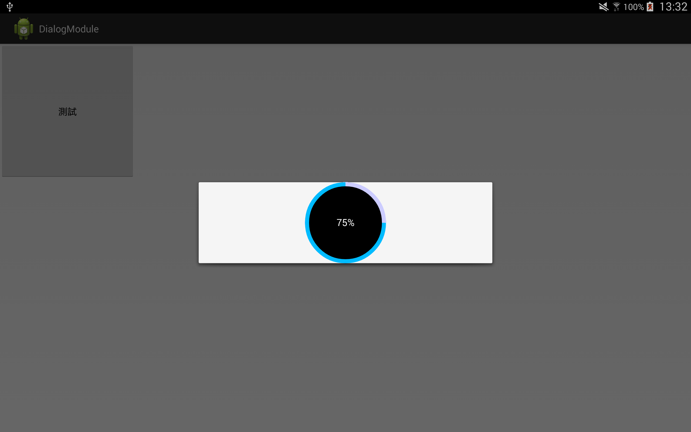

# ProgressDialogModule
圓形Dialog進度條


##開發動機
以往Android內建的進度條，格式單調也沒什麼顏色，而且看不到目前工作到底完成了多少，於是我們開發了這個可以提供使用者設定各種樣式的模組


模組裡面有提供：

1.設定、取得百分比數
2.設定、取得已完成圓弧的顏色
3.設定、取得未完成圓弧的顏色
4.設定、取得中間實心圓的顏色
5.設定、取得目前的最大值
6.設定、取得中間百分比字的大小和顏色


##示意圖



##使用說明

關鍵在於onDraw裡的三個繪圖的方式


中間先產生一個實心圓

finishPaintWidth：進度條寬度

將總寬減掉進度條寬度 / 2 = 內圓的半徑


```
float innerCircleRadius = (getWidth() - finishPaintWidth) / 2f;
    canvas.drawCircle(getWidth() / 2f, getHeight() / 2f,
        innerCircleRadius, innerCirclePaint);
```


之後再畫上已完成進度的進度條


```
finishedOuterRect.set(finishPaintWidth / 2,
 finishPaintWidth / 2,
 getWidth() - finishPaintWidth / 2,
 getHeight() - finishPaintWidth / 2);
canvas.drawArc(finishedOuterRect, 0, getProgressAngle(), false,finishedPaint);
```


drawArc這個方法是用來畫進度條(圓弧)

第一個參數為矩陣，也就是先決定左上到右下地矩形範圍，根據這個矩形範圍畫出橢圓

第二個參數為起始角度，這裡設定從0度開始

第三個參數是要畫多少角度，這裡提供一個方法getProgressAngle()取得目前完成的百分比所佔的角度

第四個參數為是否畫出圓弧兩端到圓心的邊，true就變成扇形，false就只有純粹圓弧


最後畫上目前未完成進度之進度條


```
unfinishedOuterRect.set(unfinishPaintWidth / 2,
        unfinishPaintWidth / 2,
                getWidth() - unfinishPaintWidth / 2,
                getHeight() - unfinishPaintWidth / 2);
canvas.drawArc(unfinishedOuterRect, getProgressAngle(),
        360 - getProgressAngle(), false, unfinishedPaint);
```


參數等同已完成進度的進度條畫法，但是為了要讓兩個圓弧互補成為一個圓

起始角度要改成從已完成進度的結束角度開始

要畫多少角度就將360-已完成角度

* 簡單來說，目前這個樣式就是將兩個互補的圓弧鑲嵌在一個實心圓上，顯示成像百分比的樣子


###而要產生會動的進度條樣式就可透過以下方式


* 利用執行續，依照時間改變已完成的百分比數
* 模組中有提供設定、取得百分比數


```
private Runnable runProgress = new Runnable() {
		public void run() {
			int progress = dialogView.getDialogModuleView().getProgress();
			dialogView.getDialogModuleView().setProgress(progress + 1);
			if (dialogView.getDialogModuleView().getProgress() >= dialogView
					.getDialogModuleView().getMax()) {
				handler.removeCallbacks(runProgress);
				handler = null;
			}
			if (handler != null) {
				handler.postDelayed(runProgress, 100);
			}
		}
	};
```
